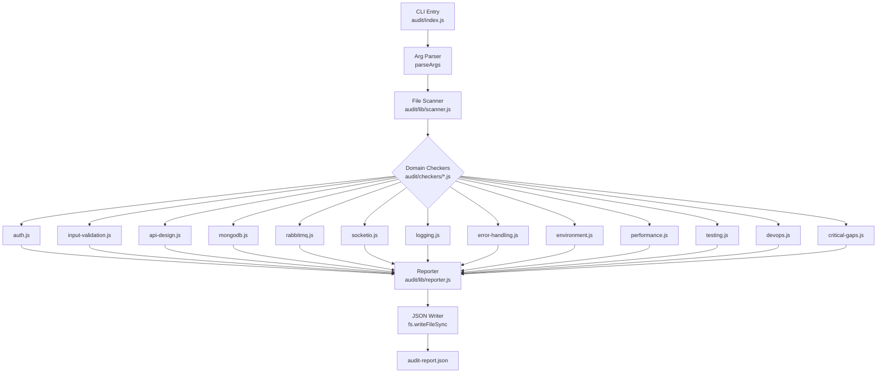

# Design Document: backend-audit

## Overview

The `backend-audit` tool is a zero-dependency (beyond Node.js built-ins and `glob`) CLI script that statically analyzes the SwiftPay codebase and produces a structured JSON Audit_Report. It does not execute the application, modify any source files, or require a running environment. Analysis is purely file-based: source files are read as strings and inspected with regex patterns and lightweight AST heuristics.

The tool is invoked from the command line:

```
node audit/index.js [--target <path>] [--output <path>]
```

- `--target` defaults to the current working directory
- `--output` defaults to `./audit-report.json`

The tool completes within 60 seconds for projects up to 200 source files and exits with code `0` on success, `1` on fatal error.

---

## Architecture



Data flows in one direction: the scanner builds a `FileIndex`, each checker receives the `FileIndex` and returns `Finding[]`, the reporter aggregates all findings into an `AuditReport`, and the writer serializes it to disk.

---

## Components and Interfaces

### `audit/index.js` — CLI Entry Point

Responsibilities:
- Parse `--target` and `--output` CLI flags
- Invoke the scanner to build the `FileIndex`
- Invoke each checker in sequence, collecting `Finding[]` arrays
- Pass all findings to the reporter
- Write the resulting `AuditReport` JSON to the output path
- Print a summary line to stdout and exit

```js
// Public interface
async function main(argv: string[]): Promise<void>
```

### `audit/lib/scanner.js` — File Scanner

Responsibilities:
- Use `glob` to discover all `.js` files under `src/`, plus specific root-level files (`server.js`, `package.json`, `.env.example`, `.gitignore`, `docker-compose.yml`, `Dockerfile*`)
- Read each file's content as a UTF-8 string
- Return a `FileIndex` object

```js
// Public interface
async function buildFileIndex(targetDir: string): Promise<FileIndex>
```

`FileIndex` structure:
```js
{
  sourceFiles: [{ path: string, content: string }],  // all .js files under src/
  rootFiles: {                                         // named root-level files
    packageJson: string | null,
    envExample: string | null,
    gitignore: string | null,
    dockerCompose: string | null,
    serverJs: string | null,
    // ...
  }
}
```

### `audit/checkers/*.js` — Domain Checkers

Each checker exports a single function:

```js
// Shared interface for all 13 checkers
function check(fileIndex: FileIndex): Finding[]
```

Checkers are pure functions — they receive the `FileIndex` and return findings with no side effects. Each checker file maps to one requirement domain.

| File | Domain | Requirement |
|---|---|---|
| `auth.js` | Authentication & Token Security | Req 1 |
| `input-validation.js` | Input Validation & Sanitization | Req 2 |
| `api-design.js` | API Design & Express Best Practices | Req 3 |
| `mongodb.js` | MongoDB & Data Layer | Req 4 |
| `rabbitmq.js` | RabbitMQ Messaging Reliability | Req 5 |
| `socketio.js` | Socket.IO Real-Time Layer | Req 6 |
| `logging.js` | Logging & Monitoring | Req 7 |
| `error-handling.js` | Error Handling & Fault Tolerance | Req 8 |
| `environment.js` | Environment & Configuration | Req 9 |
| `performance.js` | Performance & Scalability | Req 10 |
| `testing.js` | Testing Coverage | Req 11 |
| `devops.js` | DevOps & Deployment Readiness | Req 12 |
| `critical-gaps.js` | Critical Gap Detection | Req 13.8 |

### `audit/lib/reporter.js` — Report Aggregator

Responsibilities:
- Accept all `Finding[]` arrays from all checkers
- Compute the `Production_Readiness_Score`
- Determine `production_ready` boolean
- Build the `AuditReport` object
- Return the report (does not write to disk — that is the entry point's job)

```js
// Public interface
function buildReport(allFindings: Finding[], meta: ReportMeta): AuditReport
```

---

## Data Models

### `Finding`

A single check result produced by a domain checker.

```js
{
  domain:      string,   // e.g. "Authentication"
  checkId:     string,   // e.g. "AUTH-001" — unique within the tool
  status:      "passed" | "failed" | "critical",
  description: string,   // human-readable description of what was checked
  remediation: string    // actionable fix guidance (empty string for "passed")
}
```

### `AuditReport`

The top-level document written to `audit-report.json`.

```js
{
  meta: {
    tool:        string,   // "backend-audit"
    version:     string,   // tool version
    target:      string,   // absolute path of analyzed project
    generated_at: string,  // ISO 8601 timestamp
  },
  summary: {
    total_checks:  number,
    passed:        number,
    failed:        number,
    critical:      number,
    score:         number,  // 0–100 integer
  },
  production_ready: boolean,
  domains: {
    [domainName: string]: Finding[]   // keyed by domain name
  },
  critical_vulnerabilities: Finding[],  // all findings with status "critical"
  suggested_fixes:          Finding[]   // all findings with status "failed"
}
```

### `ReportMeta`

Passed from the entry point to the reporter.

```js
{
  tool:         string,
  version:      string,
  target:       string,
  generated_at: string
}
```

---

## Scoring Formula

The Production_Readiness_Score is computed by the reporter as:

```
score = round( passed / (passed + failed + critical * 2) * 100 )
```

- `critical` findings count double in the denominator, reflecting their higher severity
- If `passed + failed + critical === 0` (no checks ran), score defaults to `0`
- Score is clamped to the integer range `[0, 100]`

The `production_ready` flag is set according to:
- `true` when `score >= 60` AND `critical === 0`
- `false` otherwise (score < 60, or any critical finding exists)

---

## File Scanning Approach

The scanner uses `glob` to collect files, then reads them synchronously (acceptable because this is a CLI tool, not a server):

```js
const files = await glob('src/**/*.js', { cwd: targetDir, absolute: true });
for (const filePath of files) {
  const content = fs.readFileSync(filePath, 'utf8');
  sourceFiles.push({ path: filePath, content });
}
```

Checkers then apply regex patterns against `content` strings. Design decisions:

- Regex patterns are compiled once per checker invocation (not per file)
- Multi-file patterns (e.g., "is middleware X registered globally?") scan `app.js` and `server.js` specifically rather than all files
- Checkers that need `package.json` data parse it from `rootFiles.packageJson` using `JSON.parse`
- No AST parsing library is used; structural patterns are approximated with regex (e.g., detecting function arity for error middleware via `/\(err,\s*req,\s*res,\s*next\)/`)

---

## Correctness Properties

*A property is a characteristic or behavior that should hold true across all valid executions of a system — essentially, a formal statement about what the system should do. Properties serve as the bridge between human-readable specifications and machine-verifiable correctness guarantees.*

### Property 1: Audit Report JSON Round Trip

*For any* valid target codebase, serializing the produced `AuditReport` to JSON and then parsing it back should yield an object that is deeply equal to the original report object.

**Validates: Requirements 13.11**

---

### Property 2: Score Formula Invariant

*For any* combination of `passed`, `failed`, and `critical` counts (where at least one check exists), the computed score must satisfy `0 <= score <= 100`, and increasing `critical` by 1 (holding others constant) must never increase the score.

**Validates: Requirements 13.2**

---

### Property 3: Critical Findings Appear in critical_vulnerabilities

*For any* audit run, every `Finding` with `status === "critical"` in any domain array must also appear in the top-level `critical_vulnerabilities` array, and no finding with a different status should appear there.

**Validates: Requirements 13.4**

---

### Property 4: Failed Findings Appear in suggested_fixes

*For any* audit run, every `Finding` with `status === "failed"` in any domain array must also appear in the top-level `suggested_fixes` array, and no finding with a different status should appear there.

**Validates: Requirements 13.5**

---

### Property 5: production_ready Consistency

*For any* audit run, the `production_ready` field must be `true` if and only if `score >= 60` AND `critical_vulnerabilities.length === 0`; in all other cases it must be `false`.

**Validates: Requirements 13.6, 13.7**

---

### Property 6: Summary Counts Match Domain Findings

*For any* audit run, `summary.passed + summary.failed + summary.critical` must equal `summary.total_checks`, and each individual count must equal the number of findings with that status across all domain arrays.

**Validates: Requirements 13.1, 13.3**

---

### Property 7: Hardcoded Secret Detection

*For any* source file containing a string literal that matches a known secret pattern (e.g., `ACCESS_SECRET\s*=\s*["']`), the authentication or environment checker must produce at least one `critical` finding.

**Validates: Requirements 1.3, 1.4, 9.1**

---

### Property 8: Finding Schema Completeness

*For any* finding produced by any checker, the finding must have non-empty `domain`, `checkId`, `status`, and `description` fields, and `status` must be one of `"passed"`, `"failed"`, or `"critical"`.

**Validates: Requirements 13.1**

---

## Error Handling

| Scenario | Behavior |
|---|---|
| `--target` path does not exist | Print error to stderr, exit with code `1` |
| A source file cannot be read (permissions) | Log a warning, skip the file, continue |
| `glob` returns zero `.js` files | Produce a report with all checks as `failed`, score `0` |
| `--output` directory does not exist | Attempt `fs.mkdirSync` recursively; if it fails, print error and exit `1` |
| A checker throws an unexpected exception | Catch at the entry point, record a synthetic `critical` finding for that domain, continue with remaining checkers |
| `package.json` is malformed JSON | Log a warning, treat as absent for all checks that depend on it |

The tool never crashes silently. All errors are printed to stderr before exit.

---

## Testing Strategy

### Unit Tests

Unit tests cover individual checker functions and the reporter in isolation. Each checker is tested with synthetic `FileIndex` fixtures that represent both compliant and non-compliant codebases.

Focus areas:
- Each checker's regex patterns correctly identify the target pattern (positive and negative cases)
- The reporter's scoring formula produces correct results for boundary inputs (all passed, all critical, mixed)
- The `production_ready` flag logic at the score boundary (59 vs 60, and score >= 60 with/without criticals)
- Edge cases: empty file content, files with only comments, `package.json` missing fields

### Property-Based Tests

Property-based tests use [fast-check](https://github.com/dubzzz/fast-check) (JavaScript PBT library) with a minimum of 100 iterations per property.

Each test is tagged with a comment in the format:
`// Feature: backend-audit, Property <N>: <property_text>`

**Property 1 — Audit Report JSON Round Trip**
Generate a random `AuditReport` object (arbitrary findings, counts, score), serialize with `JSON.stringify`, parse with `JSON.parse`, and assert deep equality.
`// Feature: backend-audit, Property 1: audit report JSON round trip`

**Property 2 — Score Formula Invariant**
Generate arbitrary non-negative integer triples `(passed, failed, critical)` with at least one non-zero. Assert `0 <= score <= 100`. Generate a second triple with `critical + 1` and assert the new score is `<=` the original score.
`// Feature: backend-audit, Property 2: score formula invariant`

**Property 3 — Critical Findings Appear in critical_vulnerabilities**
Generate a random array of `Finding` objects with arbitrary statuses. Build a report. Assert that `critical_vulnerabilities` contains exactly the findings with `status === "critical"`.
`// Feature: backend-audit, Property 3: critical findings appear in critical_vulnerabilities`

**Property 4 — Failed Findings Appear in suggested_fixes**
Generate a random array of `Finding` objects. Build a report. Assert that `suggested_fixes` contains exactly the findings with `status === "failed"`.
`// Feature: backend-audit, Property 4: failed findings appear in suggested_fixes`

**Property 5 — production_ready Consistency**
Generate arbitrary `(score, criticalCount)` pairs. Assert `production_ready === (score >= 60 && criticalCount === 0)`.
`// Feature: backend-audit, Property 5: production_ready consistency`

**Property 6 — Summary Counts Match Domain Findings**
Generate random findings grouped by domain. Build a report. Assert that `total_checks === passed + failed + critical` and each count matches the actual count of findings with that status.
`// Feature: backend-audit, Property 6: summary counts match domain findings`

**Property 7 — Hardcoded Secret Detection**
Generate source file content strings that contain a hardcoded secret pattern. Run the auth or environment checker. Assert at least one `critical` finding is returned.
`// Feature: backend-audit, Property 7: hardcoded secret detection`

**Property 8 — Finding Schema Completeness**
Generate arbitrary `FileIndex` inputs and run each checker. For every returned finding, assert that `domain`, `checkId`, `status`, and `description` are non-empty strings and `status` is a valid enum value.
`// Feature: backend-audit, Property 8: finding schema completeness`

Both unit and property tests are complementary: unit tests verify concrete behavior for known inputs, property tests verify universal invariants across the space of all inputs.
